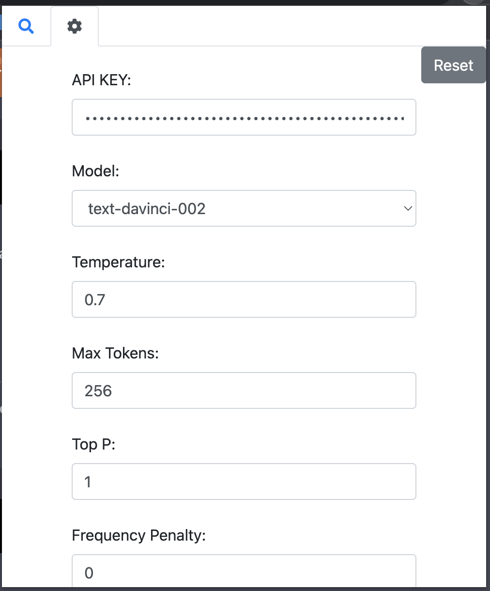
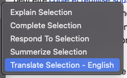
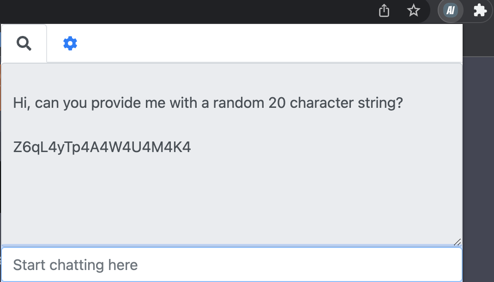

# AI Browser Assistant

The AI Browser Assistant is a Google Chrome browser extension that uses advanced AI technology from OpenAI to help users understand and interact with text on the web. With just a few clicks, users can:

- Translate selected text into a different language
- Summarize selected text to get the main points
- Complete selected text by suggesting the next word or phrase
- Respond to selected text with a relevant comment or answer
- Explain selected text by providing additional context and information
- Chat directly with the AI model using the built-in chat feature

## Getting Started

To use the AI Browser Assistant, you will need to obtain an API key from OpenAI. You can sign up for a free API key at the [OpenAI Developer Portal](https://beta.openai.com/signup/). Once you have your API key, follow these steps to get started:

1. Install the AI Browser Assistant from the [Chrome Web Store](https://chrome.google.com/webstore/). (COMING SOON - For now turn on developer mode in your extension settings, and load it unpacked)
2. Click on the extension icon to open the popup window.
3. Go to the Settings tab.
4. Enter your API key in the API Key field.
5. Click the Update Settings button to save your API key.

## Customizing the AI Model and Settings

In the Settings tab, you can customize the following options:

- **Model:** Select the AI model that you want to use for translations, summaries, completions, responses, and explanations.
- **Temperature:** Adjust the temperature of the AI model to control the creativity and randomness of its output.
- **Max Tokens:** Set the maximum number of tokens (words and punctuation) that the AI model should generate.
- **Top P:** Set the top P value to control the proportion of the mass of the distribution that the AI model should generate.
- **Frequency Penalty:** Adjust the frequency penalty to control the likelihood of the AI model generating frequent words and phrases.
- **Presence Penalty:** Adjust the presence penalty to control the likelihood of the AI model generating words and phrases that are not present in the input text.

## Using the AI Browser Assistant

To use the AI Browser Assistant, simply highlight the text that you want to translate, summarize, complete, respond to, or explain, then right-click and select the appropriate option from the context menu. 

You can also click on the extension icon to open the popup window and use the chat feature to communicate directly with the AI model.

## Notes
- Created in one sitting session utilizing chatGPT.  Believe it or not most of this project was AI generated including this entire readme (except this line).  I personally made some modifications here and there, and spent time doing a refactor at the end.
- Some features of the AI Browser Assistant may not be available for certain languages or models.
- The AI model is trained on a large dataset of text, and may generate responses that are inappropriate or offensive. Use at your own risk.

## Credits

- AI technology from [OpenAI](https://openai.com/)
- [jQuery](https://jquery.com/)
- [Bootstrap](https://getbootstrap.com/)
- [Font Awesome](https://fontawesome.com/)
